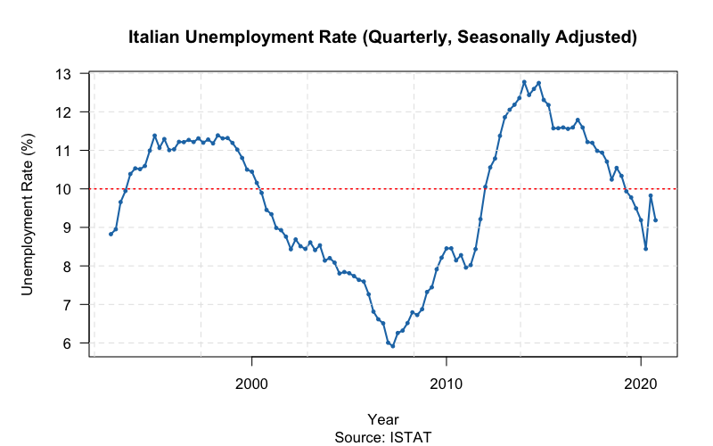

# istatR

R Interface to the Italian National Institute of Statistics (ISTAT) API

## Overview

`istatR` provides an R interface to the [ISTAT SDMX RESTful API](https://esploradati.istat.it/SDMXWS/rest), allowing users to:

- Discover all available ISTAT datasets
- Search for datasets by keyword
- Explore dataset structure and dimensions
- Retrieve statistical data with flexible filtering

This package is inspired by the Python [istatapi](https://github.com/Attol8/istatapi) package by Jacopo Attolini.

## Installation

```r
# Install from source
# devtools::install_github("your-username/istatR")

# Or install locally
devtools::install_local("path/to/istatR")
```

## Usage

### 1. Explore Available Datasets

```r
library(istatR)

# List all available datasets
datasets <- all_available()
head(datasets)
#> # A tibble: 6 × 4
#>   df_id   version df_description                                df_structure_id
#>   <chr>   <chr>   <chr>                                         <chr>
#> 1 101_1015 1.0    Population by marital status                  DCIS_POPRES1
#> 2 115_333  1.0    Consumer price index                          DCSP_IPCA
#> ...

# Search for specific datasets
import_datasets <- search_dataset("import")
population_datasets <- search_dataset("population")
```

### 2. Create a Dataset Object

```r
# Create dataset by ID
ds <- istat_dataset("139_176")
print(ds)
#> ISTAT Dataset
#> -------------
#> ID:           139_176
#> Version:      1.0
#> Description:  Foreign trade - imports and exports
#> Structure:    DCSC_COMMEST_EPORT
#>
#> Dimensions (7):
#>   - FREQ: (all)
#>   - MERCE_ATECO_2007: (all)
#>   - PAESE_PARTNER: (all)
#>   ...
```

### 3. Explore Dataset Structure

```r
# View dimension information
dimensions_info(ds)
#> # A tibble: 7 × 4
#>   dimension_id      position codelist_id              description
#>   <chr>                <int> <chr>                    <chr>
#> 1 FREQ                     1 CL_FREQ                  Frequency
#> 2 MERCE_ATECO_2007         2 CL_MERCE_ATECO2007       Product (ATECO 2007)
#> ...

# Get available values for a specific dimension
get_dimension_values(ds, "TIPO_DATO")
#> # A tibble: 4 × 2
#>   id    name
#>   <chr> <chr>
#> 1 ISAV  Imports - value
#> 2 ESAV  Exports - value
#> 3 ISAQ  Imports - quantity
#> 4 ESAQ  Exports - quantity

# Get all available values
available <- get_available_values(ds)
available$FREQ
```

### 4. Set Filters and Retrieve Data

```r
# Set filters
ds <- set_filters(ds,
  FREQ = "M",
  TIPO_DATO = c("ISAV", "ESAV"),  # Multiple values
  PAESE_PARTNER = "WORLD"
)

# Retrieve data
data <- get_data(ds)

# Or use time period filters
data <- get_data(ds,
  start_period = "2020-01-01",
  end_period = "2023-12-31"
)

# Get only the last 12 observations
data <- get_data(ds, last_n_observations = 12)
```

### 5. Quick Retrieval (One-liner)

```r
# Combine all steps in one function call
data <- istat_get(
  "139_176",
  FREQ = "M",
  TIPO_DATO = "ISAV",
  PAESE_PARTNER = "WORLD",
  start_period = "2022-01-01"
)
```

## Main Functions

| Function | Description |
|----------|-------------|
| `all_available()` | List all available ISTAT datasets |
| `search_dataset(keyword)` | Search datasets by keyword in description |
| `istat_dataset(id)` | Create a dataset object for exploration |
| `dimensions_info(ds)` | Get information about dataset dimensions |
| `get_dimension_values(ds, dim)` | Get available values for a dimension |
| `get_available_values(ds)` | Get all available values for all dimensions |
| `set_filters(ds, ...)` | Set dimension filters |
| `reset_filters(ds)` | Reset all filters to default |
| `get_data(ds)` | Retrieve data with current filters |
| `istat_get(id, ...)` | Quick retrieval combining all steps |
| `istat_timeout(seconds)` | Get or set the API timeout |

## API Timeout

**Note:** The ISTAT API can be slow to respond, especially when listing all datasets or retrieving large amounts of data. The default timeout is set to **300 seconds (5 minutes)** to accommodate this.

If you encounter timeout errors, you can increase the timeout:

```r
# Check current timeout
istat_timeout()
#> [1] 300

# Increase timeout to 10 minutes
istat_timeout(600)

# Or even longer for very large queries
istat_timeout(900)  # 15 minutes
```

## API Reference

This package uses the ISTAT SDMX REST API:
- Base URL: `https://esploradati.istat.it/SDMXWS/rest`
- Agency ID: `IT1`

See the [API documentation](https://developers.italia.it/it/api/istat-sdmx-rest) for more details.

## Example: Plotting Italian Unemployment Rate

Here's a complete example that retrieves Italian unemployment rate data and creates a visualization using base R graphics:

```r
library(istatR)

# Search for unemployment datasets
unemp_datasets <- search_dataset("unemployment")
head(unemp_datasets)

# Get quarterly unemployment rate data (seasonally adjusted)
ds <- istat_dataset("151_1178")
ds <- set_filters(ds,
  FREQ = "Q",           # Quarterly data
  REF_AREA = "IT",      # Italy
  DATA_TYPE = "UNEM_R", # Unemployment rate
  SEX = "9",            # Total (both sexes)
  AGE = "Y_GE15"        # 15 years and over
)

unemp_data <- get_data(ds)

# Remove duplicates (different editions) and sort
unemp_data <- unemp_data[!duplicated(unemp_data$TIME_PERIOD), ]
unemp_data <- unemp_data[order(unemp_data$TIME_PERIOD), ]

# Create the plot
par(mar = c(5, 5, 4, 2))
plot(
  unemp_data$TIME_PERIOD,
  unemp_data$OBS_VALUE,
  type = "l",
  lwd = 2,
  col = "#1f77b4",
  xlab = "Year",
  ylab = "Unemployment Rate (%)",
  main = "Italian Unemployment Rate (Quarterly, Seasonally Adjusted)",
  sub = "Source: ISTAT",
  las = 1,
  cex.main = 1.2
)
grid(col = "gray90", lty = 2)

# Add points for emphasis
points(unemp_data$TIME_PERIOD, unemp_data$OBS_VALUE,
       pch = 19, col = "#1f77b4", cex = 0.5)

# Add horizontal reference line at 10%
abline(h = 10, col = "red", lty = 3, lwd = 1.5)
```

This produces a time series plot showing the evolution of Italian unemployment from 1992 to 2020:



**Note:** The ISTAT API can occasionally be slow or temporarily unavailable. If you experience connection issues, try again later or increase the timeout with `istat_timeout(600)`.

## License
Apache License 2.0

## Acknowledgments

- Inspired by [istatapi](https://github.com/Attol8/istatapi) Python package by Jacopo Attolini
- Data provided by [ISTAT](https://www.istat.it/) - Italian National Institute of Statistics
